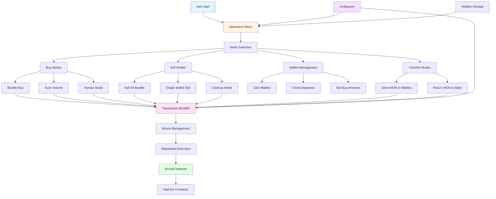

# 🤖 Nad.fun Volume & Bundler Comprehensive Bot

## Overview

The **Nad.fun Volume & Bundler Comprehensive Bot** is a powerful tool designed to automate trading activities on the Nad.fun platform (Monad Network). With a suite of customizable modes for buying, selling, and wallet management, this bot provides a fully automated solution for generating volume, bundling transactions, executing trades, and managing wallets for optimizing token activities.

Built using **Node.js** and **ethers.js**, the bot supports advanced functionality such as transaction bundling, MEV protection, and enables quick and efficient token purchases and sales across multiple wallets on the Monad blockchain.


## Architecture Diagram



## Features

- **Multiple Buying Modes**: Includes modes for generating volume, monitoring new launches, and human-like trading patterns
- **Selling Modes**: Includes bulk sell, single wallet sell, and cleanup modes to manage your token holdings effectively
- **Wallet Management**: Create and manage EVM wallets, check balances (MON and tokens)
- **Transfer Modes**: Efficiently transfer MON between wallets and consolidate balances
- **Transaction Bundling**: Execute multiple transactions efficiently with proper nonce management
- **Custom Configurations**: Adjustable settings for delays, slippage, buy/sell amounts, and more
- **Nad.fun Integration**: Full support for nad.fun bonding curve and DEX contracts

## Prerequisites

To run the **Nad.fun Volume Bot**, ensure you have the following:

- **Node.js** (v18+): [Download Node.js](https://nodejs.org)
- **npm**: The Node.js package manager, which comes pre-installed with Node.js
- **RPC URL**: Required to connect to Monad network (testnet or mainnet)
- **Wallet Private Key**: Private key for your main wallet (for distributing MON to sub-wallets)

## Installation

### Step 1: Install Node.js

Ensure that **Node.js** is installed on your system. If not, download and install it from the official website:

- [Download Node.js](https://nodejs.org)

### Step 2: Clone or Navigate to the Repository

```bash
cd nadfun-bundler
```

### Step 3: Install Dependencies

```bash
npm install
```

## Configuration

The bot is highly configurable, allowing you to modify various settings in the `config.json` file. Below is a detailed guide for configuring the bot to suit your needs.

### `config.json`

The configuration file contains key parameters that define the bot's behavior. Here is a breakdown of each parameter:

```json
{
    "rpc": "https://monad-testnet.rpc.url",  // RPC endpoint for Monad network
    "ws": "wss://monad-testnet.ws.url",      // WebSocket endpoint (optional)
    "chainId": 10143,                         // Monad Testnet chain ID
    "delay": 5000,                            // Delay in milliseconds between actions
    "slippage": 0.05,                         // Slippage tolerance (0.05 = 5%)
    "minBuy": 0.0001,                         // Minimum buy amount in MON
    "maxBuy": 0.1,                            // Maximum buy amount in MON
    "microBuyAmount": 0.0001,                 // Small amount for micro buys
    "gasPrice": null,                         // Gas price in gwei (null = auto)
    "gasLimit": 300000,                       // Gas limit per transaction
    "maxWalletsPerBundle": null,              // Max wallets per bundle (null = unlimited)
    "sender": "YOUR_PRIVATE_KEY_HERE",        // Private key of main wallet
    "devWallet": "",                          // Address to monitor for new launches
    "useBundle": true,                        // Use transaction bundling
    "contracts": {
        "bondingCurveRouter": "0x6F6B8F1a20703309951a5127c45B49b1CD981A22",
        "bondingCurve": "0xA7283d07812a02AFB7C09B60f8896bCEA3F90aCE",
        "dexRouter": "0x0B79d71AE99528D1dB24A4148b5f4F865cc2b137",
        "dexFactory": "0x6B5F564339DbAD6b780249827f2198a841FEB7F3",
        "wmon": "0x3bd359C1119dA7Da1D913D1C4D2B7c461115433A",
        "lens": "0x7e78A8DE94f21804F7a17F4E8BF9EC2c872187ea"
    }
}
```

### Important Configuration Notes

- **RPC URL**: You need a Monad RPC endpoint. For testnet, check Monad documentation.
- **Private Key**: Never commit your private key to version control. Keep it secure.
- **Contract Addresses**: These are the official nad.fun contract addresses. Update if they change.

## Available Modes

### 1. Buy Modes

#### Bundle Buy (Nad.fun)
Generates volume by bundling buy transactions across multiple wallets. Enter the token address (CA) and delay between transactions. The bot will create buy transactions for wallets with randomized amounts between minBuy and maxBuy.

**Bundle Size**: By default, processes ALL wallets. Set `maxWalletsPerBundle` in config.json to limit (recommended: 10-50 wallets). See `BUNDLE_LIMITS.md` for details.

#### Auto Volume
Monitors the dev wallet address (configured in config.json) and automatically executes trades when a new token is launched. This mode performs a Buy-Buy-Sell cycle until all wallets have completed their actions.

#### Human Mode
Manually initiated mode that performs a Buy-Buy-Sell cycle with randomized delays. Each wallet buys twice with random delays, then sells a percentage of tokens. This simulates human-like trading behavior.

### 2. Sell Modes

#### Sell All (Bundle)
Bundles all wallets and sells a specified percentage of tokens from each wallet. Useful for quick exits or taking profits.

#### Single Wallet Sell
Prompts for a token address and wallet selection. The bot will sell 100% of tokens from the selected wallet.

#### Cleanup Mode
Sells all Nad.fun tokens from all wallets. This mode requires manual token specification (full automatic cleanup coming soon).

### 3. Wallet Modes

#### Gen Wallets
Generates a specified number of EVM wallets, storing them securely in the `/keypairs` folder along with the `wallets.txt` file.

#### Check Balances
Checks MON and token balances for all wallets. Optionally specify a token address to check token balances.

#### Set Buy Amounts
Configure custom buy amounts for different wallets (coming soon).

### 4. Transfer Modes

#### Send MON to Volume Wallets
Transfers MON from the main wallet (sender address in config) to all sub-wallets. You can specify an amount per wallet or let it auto-calculate.

#### Return MON to Main Wallet
Sends MON from all sub-wallets back to the main wallet, leaving a small reserve (0.0009 MON) in each wallet for gas.

## Usage

### Starting the Bot

```bash
npm start
```

This will launch the interactive menu system where you can select different modes and options.

### Example Workflow

1. **Generate Wallets**: Go to Wallets menu → Gen Wallets → Enter number of wallets
2. **Fund Wallets**: Go to Transfer menu → Send MON to Volume Wallets
3. **Buy Tokens**: Go to Buy Modes → Bundle Buy → Enter token address and delay
4. **Check Balances**: Go to Wallets menu → Check Balances → Enter token address
5. **Sell Tokens**: Go to Sell Modes → Sell All → Enter token address and percentage

## Key Differences from Solana Version

- **Network**: Monad (EVM) instead of Solana
- **Transactions**: EVM transactions instead of Solana transactions
- **Bundling**: Sequential transaction bundling instead of JITO bundles
- **Native Token**: MON instead of SOL
- **Token Standard**: ERC-20 instead of SPL tokens
- **Wallet Format**: Ethereum-style wallets instead of Solana keypairs

## Token Creation Percentage Issue

When users create tokens on nad.fun, they hold a percentage of tokens. The bot includes functionality to handle this by buying tokens from the bonding curve, which reduces the creator's percentage. See `src/nadfun/handleCreatorTokens.js` for details.

## Contract Addresses

All contract addresses are from the official nad.fun documentation:

- **Bonding Curve Router**: `0x6F6B8F1a20703309951a5127c45B49b1CD981A22`
- **Bonding Curve**: `0xA7283d07812a02AFB7C09B60f8896bCEA3F90aCE`
- **DEX Router**: `0x0B79d71AE99528D1dB24A4148b5f4F865cc2b137`
- **DEX Factory**: `0x6B5F564339DbAD6b780249827f2198a841FEB7F3`
- **WMON**: `0x3bd359C1119dA7Da1D913D1C4D2B7c461115433A`
- **Lens**: `0x7e78A8DE94f21804F7a17F4E8BF9EC2c872187ea`

## Security Notes

- **Private Keys**: Never share your private keys or commit them to version control
- **Testnet First**: Always test on testnet before using mainnet
- **Gas Fees**: Monitor gas prices and adjust gasLimit/gasPrice in config if needed
- **Slippage**: Set appropriate slippage tolerance based on market conditions
- **Wallet Backups**: Regular backups of your wallets.txt and keypairs folder

## Troubleshooting

### Common Issues

1. **"No wallets found"**: Generate wallets first using the Wallets menu
2. **"Insufficient balance"**: Fund your wallets using the Transfer menu
3. **Transaction failures**: Check gas prices, slippage settings, and network connectivity
4. **"Token not listed"**: Verify the token address is correct and the token is on nad.fun bonding curve

## Development

The bot is built with:
- **Node.js** (ES Modules)
- **ethers.js** (v6) for blockchain interactions
- **chalk** for colored console output

## Contributing

Contributions are welcome! Please ensure all code follows the existing style and includes proper error handling.

## License

ISC License

## Disclaimer

This bot is for educational and research purposes. Trading cryptocurrencies involves risk. Use at your own risk. The authors are not responsible for any financial losses.

## Support

For issues and questions, please check the codebase or create an issue in the repository.

## Connect
 [Telegram](https://t.me/rust_devv)
 [X](https://x.com/t_rustdev_)

---

**Note**: This is an updated version converted from the Solana pump.fun bundler to work with Nad.fun on Monad network. Some features from the original version may be simplified or removed for EVM compatibility.
